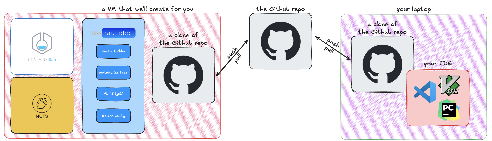

# AutoCon 3 | WS:D2
### Design-Driven (Container)Labs and Change Validation

## About the workshop
As part of the AutoCon 3 event, in this workshop we will attempt to dip our toes into the world of design-driven automation and test-driven change validation. If this sounds like a buzzword bingo, well, you are not wrong. The initial idea for this workshop was to create a lab that would focus on the four most used words in the previous AutoCon event: automation, design, containerlab, and testing (or at least this is how I remembered them as I couldn't find the original word cloud that inspired the idea).

Jokes aside, in this workshop we will be touching on the following components/tools:
- **Source of Truth (SoT)**: Nautobot
- **Design-Driven Automation**: Design Builder (a Nautobot App)
- **Digital Twin**: Containerlab
- **Network Testing**: NUTS
- **Change Validation**: Golden Config (another Nautobot App)

The goal is to create a pipeline of sorts that will allow us to try out changes, designs, and ideas in a safe environment, before we push them to production.

## Prerequisites
All workshop materials are available on Github: https://github.com/networktocode/autocon3-design-workshop (still working on a few minor things, but the main content is there).

In order to make things smoother (and avoid surprises like running out of Codespaces credits), Network to Code will provide a preconfigured cloud development environment (also available via browser). This includes all major dependencies, such as the software stack previously described, the Arista EOS Docker image that we'll be using for containerlab, etc. You’ll receive login instructions a few hours before the session.

What can you do ahead of time?
- **Create a Github account**: If you don't have one already, please create a Github account. You will need it to fork the original repository and work independently on your own copy of the lab. It won't hurt if you also create a Personal Access Token (PAT) as described in the respective section of the lab guide.
- **Install an IDE**: If you don't have one already, please install an IDE. I recommend using Visual Studio Code (VSCode) as it is free and has a lot of extensions that play well with the lab (Git, Markdown preview, containerlab extension, etc). You can also use PyCharm or any other IDE of your choice. Bonus points if it can help with development over SSH (like VSCode).

The following diagram shows the architecture of the lab environment.

## About the lab guide
The lab guide has been created using Scribe, an AI tool that allows you to create step-by-step guides by recording your screen and generate a tutorial document with screenshots and instructions. I recommend that you log into their portal and also add their extension to your browser. It may seem a bit intrusive but it greatly enhances your ability to follow the guide. You can find the original Scribe document [here](https://scribehow.com/page/AutoCon_3_or_WSD2__LmswNs-LSV-hIP1nlgfQrw).

For those of you that prefer not to use it (totally understandable choice), I have also created a Markdown version of the guide. You can find it [here](./lab_guide/99.lab_guide.md).

