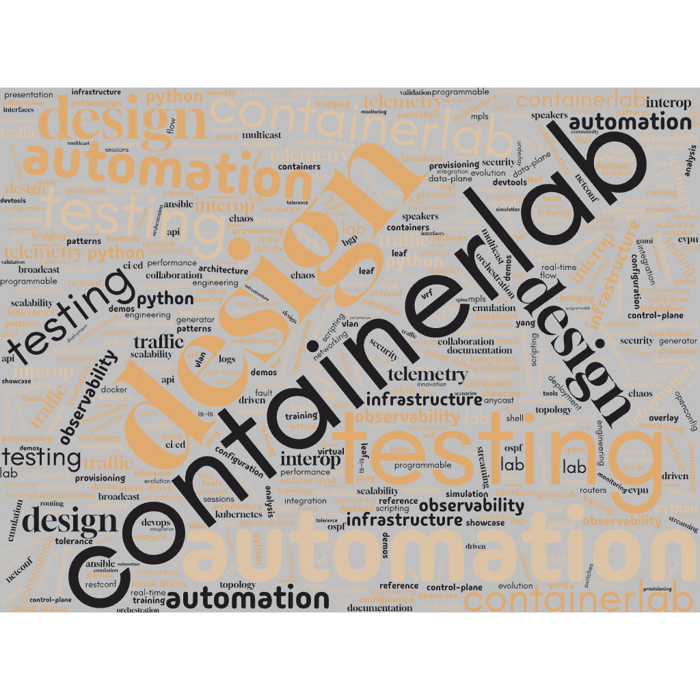

<!-- _paginate: false -->
<!-- _footer: "Network to Code - Federico Olivieri, Marek Zbroch, Nikos Kallergis, Przemek Rogala" -->
<!-- _class: lead invert -->

## design-driven (container)labs
## & change validation

---
<!-- _class: lead invert -->

### >>> introduction

---
<!-- _header: introduction -->

- Federico Olivieri
- Marek Zbroch
- Nikos Kallergis
- Przemek Rogala

---
<!-- _class: lead invert -->

### >>> inspired by the community

---

---
<!-- _class: lead invert -->

### >>> today's labs

---
<!-- _header: today's labs -->

- **lab 1**: create a new branch with design builder
- **lab 2**: spin up a digital twin with containerlab
- **lab 3**: create tests with NUTS
- **lab 3**: validate config changes wit golden config

---
<!-- _class: lead invert -->

### >>> but first a little bit of theory

---
<!-- _header: but first a little bit of theory -->

### >>> what is a source of truth?
- *"everything you need to know in order to build your whole network from the ground up"*

---
<!-- _header: but first a little bit of theory -->

### >>> what is a digital twin?
- a virtual representation of a physical object or system
- simulate, analyze, optimize the physical counterpart
- test new designs and configurations

---
<!-- _header: but first a little bit of theory -->

### >>> what is test-driven development?
- process "borowed" from software development
- write tests before writing code/configuration
- tests are used to validate configs before deploying

---
<!-- _header: but first a little bit of theory -->

### >>> what is a golden config?
- a configuration artifact generated from the SoT
- also the name of the respective nautobot plugin
- useful for deploying configs and compliance (does my running config match the golden config?)

---
<!-- _class: lead invert -->

### >>> let's jump into the labs!
