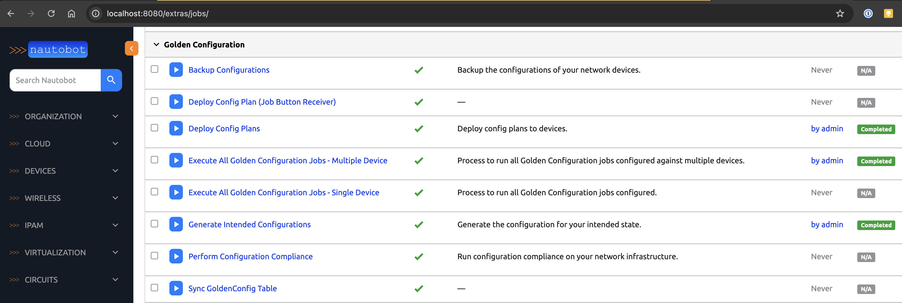
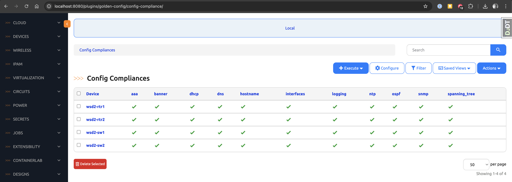
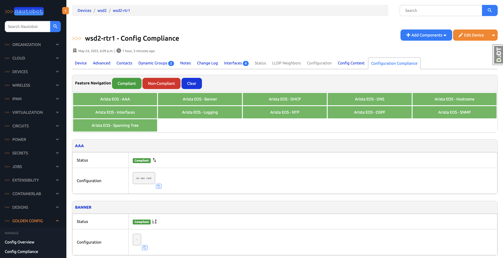
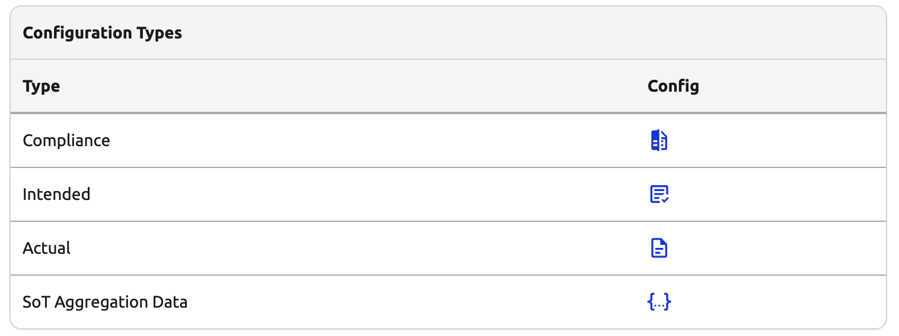
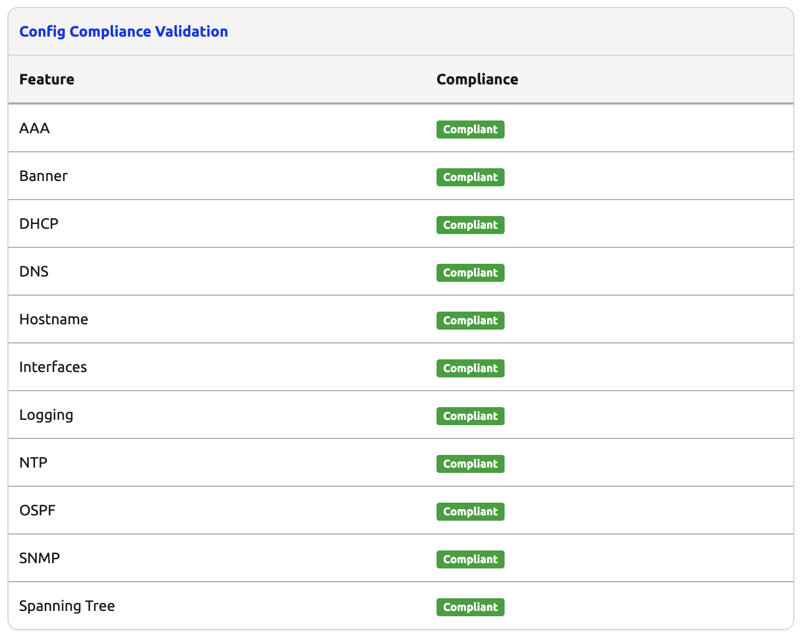

<!-- _class: lead invert -->

### >>> introduction to Golden Config

---
<!-- _header: introduction to Golden Config -->

### >>> Golden Config
- a Nautobot App for configuration management
- backs up running device configurations
- generates intended configurations
- performs compliance checks (running vs intended)
- remediates configuration drift

---
<!-- _header: Golden Config Jobs -->

---
<!-- _header: Golden Config Compliance -->

---
<!-- _header: Golden Config Compliance Device Tab -->

---
<!-- _header: Golden Config Device Panes -->

